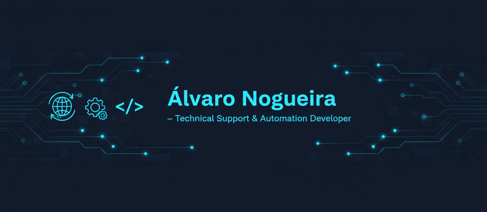

<!-- Banner -->

  

<h1 align="center">👋 Hi, I'm Álvaro Nogueira</h1>
<h3 align="center">Network Support Technician | Automation Enthusiast | Problem Solver</h3>

---

### 💡 About Me

I work at **Brisanet (Brazil)** providing **technical support and network assistance** to customers, solving connectivity issues, ensuring network stability, and delivering excellent service.  

Driven by **proactivity and curiosity**, I develop **automation tools** that streamline internal processes, reduce repetitive tasks, and enhance the efficiency of our support operations.  

Some of my highlights:
- 🧩 Created internal scripts and bookmarklets to optimize technical support workflows  
- ⚙️ Automated repetitive configurations to save time and minimize human error  
- 💬 Strong focus on communication, problem-solving, and customer satisfaction  
- 🚀 Constantly improving systems through small, impactful innovations  

---

### ⚡ Fun Fact

> “Great support isn’t just about fixing problems - it’s about improving how we solve them.”

---

⭐️ *Combining customer service with automation to build faster, smarter solutions.*

---

---